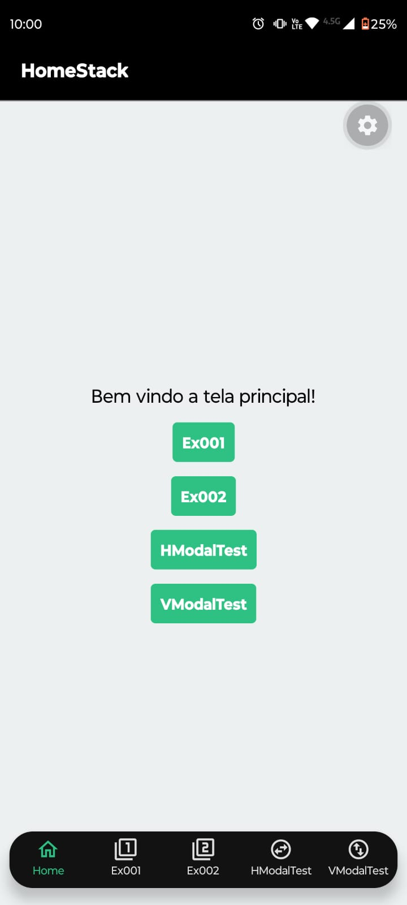
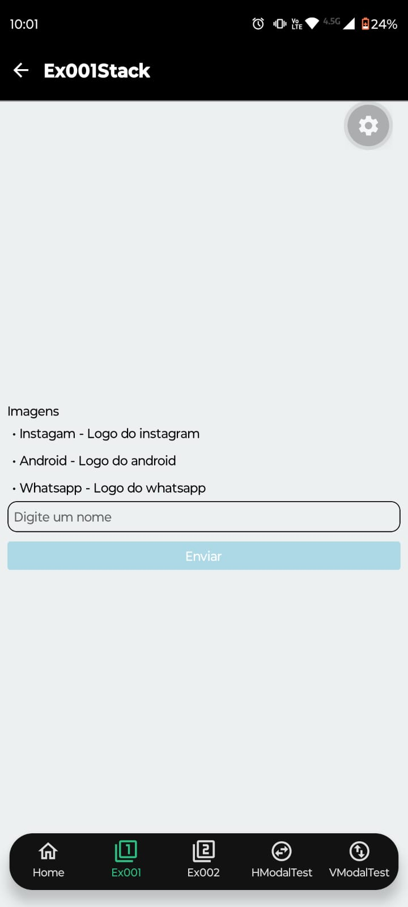
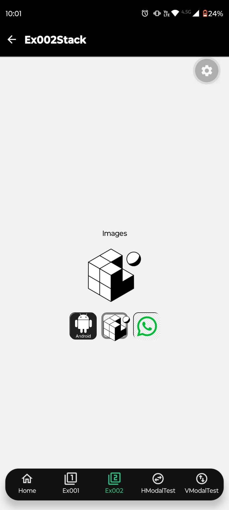
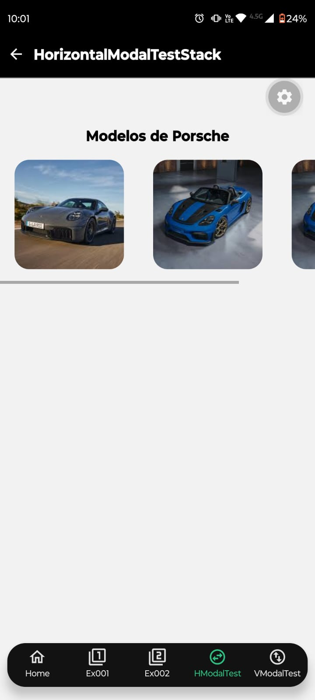
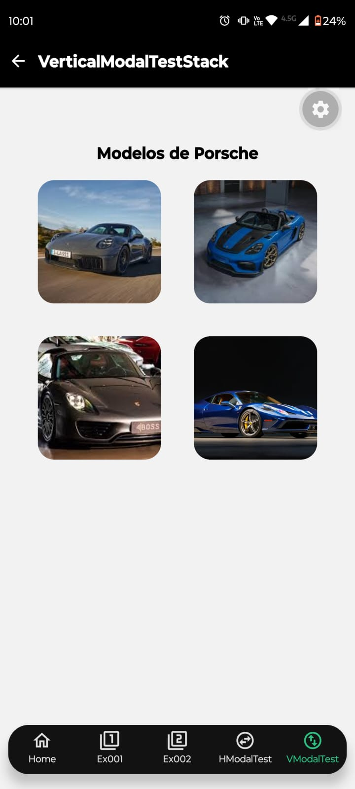

# PAM CLI - React Navigation

Aplicativo mobile desenvolvido para a disciplina de **PAM (Programação de Aplicativos Mobile)**, com o objetivo de demonstrar diferentes tipos de navegação utilizando **React Native**, **Expo** e **React Navigation**.

O projeto reúne diferentes exercícios desenvolvidos durante as aulas em um único aplicativo. Cada exercício é organizado em uma `Screen` própria e pode ser acessado por meio da navegação da aplicação.

---

## 👨‍💻 Desenvolvedores

Projeto desenvolvido por:

**Murilo Santos**
**e**
**Matheus Barros**

Projeto acadêmico desenvolvido para a disciplina de **PAM — Programação de Aplicativos Mobile**.

---

## 📱 Sobre o projeto

O **PAM CLI - React Navigation** foi desenvolvido como um aplicativo demonstrativo de diferentes tipos de navegação em aplicações mobile, utilizando principalmente os padrões **Tabs** e **Stack** do React Navigation.

Durante as aulas, os exercícios foram inicialmente desenvolvidos como aplicações separadas. Neste projeto, eles foram reunidos em uma única aplicação, mantendo cada exercício separado em sua própria `Screen` e estrutura de navegação.

O aplicativo conta com exemplos envolvendo:

* Navegação com **Tabs**
* Navegação com **Stack**
* `TextInput`
* `Image`
* `Pressable`
* `TouchableOpacity`
* `FlatList` horizontal
* `FlatList` vertical com duas colunas
* Modais com informações dos itens selecionados

---

## 🎯 Objetivo acadêmico

O projeto foi desenvolvido para a disciplina de **PAM — Programação de Aplicativos Mobile**, com foco na aplicação prática dos conceitos de navegação e desenvolvimento de interfaces utilizando React Native.

---

## 🛠️ Tecnologias utilizadas

| Tecnologia           | Utilização                                               |
| -------------------- | -------------------------------------------------------- |
| **React Native**     | Desenvolvimento da aplicação mobile                      |
| **TypeScript**       | Tipagem e desenvolvimento do código                      |
| **Expo**             | Ambiente e ferramentas para desenvolvimento React Native |
| **React Navigation** | Implementação das navegações Tabs e Stack                |

**Expo SDK:** `57`

---

## 🧭 Estrutura de navegação

A aplicação utiliza uma estrutura combinando **Stack Navigator** e **Bottom Tab Navigator**.

```text
RootNavigator (Stack)
│
└── TabsNavigator (Tabs)
    │
    ├── HomeStack (Stack)
    │
    ├── Ex001Stack (Stack)
    │
    ├── Ex002Stack (Stack)
    │
    ├── HorizontalModalTestStack (Stack)
    │
    └── VerticalModalTestStack (Stack)
```

A tela `Home` funciona como a principal tela de acesso aos exercícios. Ao selecionar uma das opções disponíveis, o usuário é direcionado para a respectiva `Screen` por meio da navegação Stack.

O indicador das Tabs também é atualizado de acordo com a tela atualmente acessada.

---

## 📋 Exercícios e telas

### Home

Tela principal da aplicação.

Possui os botões de acesso aos diferentes exercícios. Ao selecionar uma opção, o usuário é direcionado para a respectiva tela por meio da navegação Stack.

---

### Ex001

Demonstra a utilização de `TextInput` e `Image`.

A tela possui uma lista de nomes:

* Instagram
* Android
* WhatsApp

Ao digitar um dos nomes disponíveis no `TextInput`, a logo correspondente é exibida em um componente `Image`.

---

### Ex002

Demonstra a utilização de `Pressable`.

A tela possui três componentes `Pressable`, cada um representando uma logo.

Ao pressionar um dos componentes, a logo correspondente é exibida em um componente `Image` localizado acima dos botões.

---

### HorizontalModalTest

Demonstra a utilização de uma `FlatList` horizontal, `TouchableOpacity` e modal.

A tela apresenta uma lista horizontal contendo imagens de diferentes veículos.

Ao selecionar um veículo, é aberto um modal contendo informações detalhadas, como:

* ID do veículo
* Nome do veículo
* Modelo

---

### VerticalModalTest

Demonstra uma `FlatList` vertical organizada em **duas colunas**, utilizando `TouchableOpacity` e modal.

Os veículos apresentados possuem as mesmas imagens utilizadas na tela `HorizontalModalTest`.

Ao selecionar um veículo, é exibido um modal contendo as mesmas informações:

* ID do veículo
* Nome do veículo
* Modelo

---

## 📁 Estrutura do projeto

```text
PAM_3bim_CLI/
│
├── assets/
│   ├── adaptive-icon.png
│   ├── favicon.png
│   ├── icon.png
│   └── splash-icon.png
│
├── components/
│   ├── HeaderComponent/
│   └── screens/
│
│
├── navigation/
│   ├── RootNavigator/
│   ├── Stacks/
│   └── TabsNavigator/
│
├── AGENTS.md
├── app.json
├── App.tsx
├── CLAUDE.md
├── index.ts
├── LICENSE
├── package-lock.json
├── package.json
├── PAM_3bim_CLI.mp4
├── README.md
└── tsconfig.json
```

### Principais diretórios

**`components/`**
Contém componentes reutilizáveis e as telas utilizadas pela aplicação.

**`navigation/`**
Responsável pela estrutura de navegação do aplicativo, incluindo os navegadores Stack e Tabs.

**`assets/`**
Armazena os arquivos utilizados pelo Expo, como ícones e imagem de splash.

---

## ⚙️ Pré-requisitos

Para executar o projeto, é necessário ter um ambiente configurado para desenvolvimento com Expo.

Durante o desenvolvimento deste projeto, foi utilizado:

```text
Node.js LTS 24.14.1
Expo SDK 57
```

Também é necessário possuir um dispositivo Android físico para reproduzir o ambiente em que o projeto foi testado.

> O projeto foi testado em **dispositivo Android físico**. A execução em **emulador Android** também é possível utilizando os comandos disponibilizados pelo Expo.

---

## 🚀 Instalação e execução

### 1. Clone o repositório

```bash
git clone https://github.com/DevMuriloSantos/PAM_3bim_CLI.git
```

### 2. Acesse a pasta do projeto

```bash
cd PAM_3bim_CLI
```

### 3. Instale as dependências

```bash
npm install
```

### 4. Inicie o projeto

```bash
npx expo start
```

Após iniciar o servidor do Expo, utilize o ambiente de execução desejado para abrir a aplicação.

---

## 📡 Outras formas de execução

### Dispositivo em uma rede diferente

Caso o computador e o dispositivo estejam conectados a redes diferentes:

```bash
npx expo start --tunnel
```

### Emulador Android

Para iniciar diretamente no emulador Android:

```bash
npx expo start --android
```

---

## 📸 Screenshots

### Home



### Ex001



### Ex002



### HorizontalModalTest



### VerticalModalTest



---

## 🎥 Demonstração

O repositório contém um vídeo demonstrativo do aplicativo:

**`PAM_3bim_CLI.mp4`**

[▶️ Acessar o vídeo de demonstração](./PAM_3bim_CLI.mp4)

---

## 📄 Licença

Este projeto está licenciado sob a **MIT License**.

Consulte o arquivo [`LICENSE`](./LICENSE) para obter os termos completos da licença.
